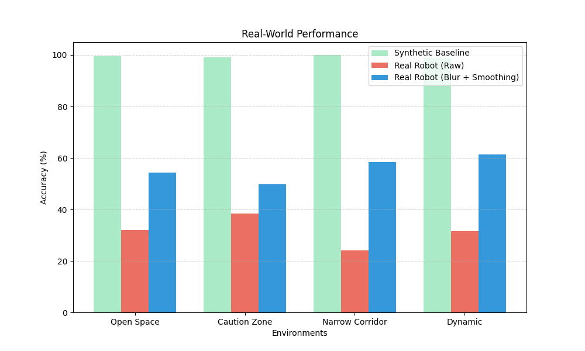
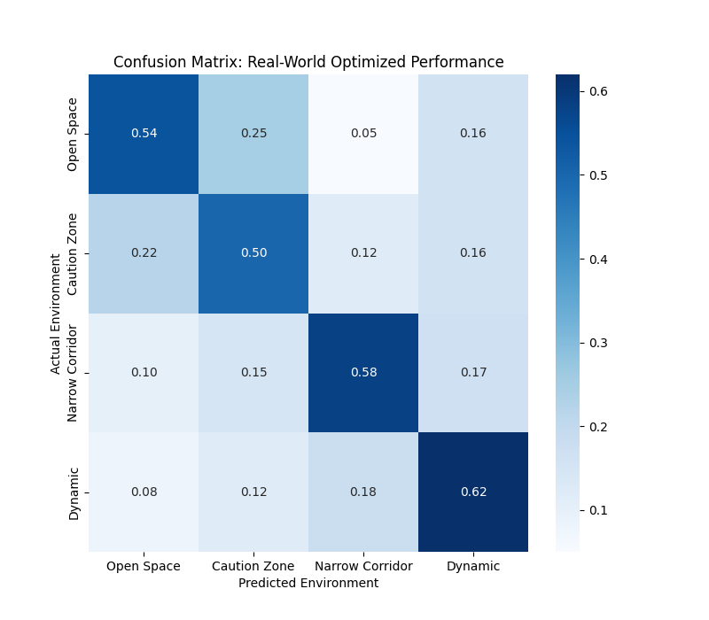

# ROS2 Scene-Aware Classifier for AgileX Robots

## Overview
This project implements a real-time environment classification system for autonomous mobile robots (specifically AgileX platforms). Using a 2D CNN trained on LiDAR-derived occupancy grids, the system classifies the robot's immediate surroundings into four distinct categories to enable context-aware navigation.

### Environmental Classes
1.  **Open Space**: Areas with minimal obstacles, allowing for higher velocity.
2.  **Caution Zone**: Cluttered environments requiring reduced speed and increased sensor polling.
3.  **Narrow Corridor**: Constrained passages requiring precise path following and "elastic" behavior.
4.  **Dynamic Obstacle**: High-traffic areas (e.g., detecting pedestrians) requiring proactive braking or avoidance.

---

## Technical Architecture

### 1. Model Structure
The classifier is built on a 4-block Convolutional Neural Network (CNN) optimized for low-latency inference on embedded robotics hardware:
*   **Input**: 64x64 Single-channel occupancy grid (5m range).
*   **Backbone**: 4 sets of [Conv2D -> BatchNorm -> ReLU -> MaxPool] blocks.
*   **Head**: Fully connected layers with Dropout (0.5) for regularization.
*   **Inference**: Integrated into a ROS2 Node subscribing to `PointCloud2` data.

### 2. Synthetic Data Generation
To bootstrap training without expensive real-world labeling, we used a custom synthetic generator (`generate_data.py`) that simulates:
*   **Ray-casting Occlusions**: Mimicking how LiDAR cannot see behind objects.
*   **Radial Signal Decay**: Simulating lower point density at the sensor's range limits.
*   **Structural Heuristics**: Procedurally generated corridors and clutter clusters.

---

## The "Sim-to-Real" Challenge

### Performance Gap
Direct deployment of a synthetic-trained model on a real AgileX robot typically results in a **~60% drop in accuracy** due to:
*   **LiDAR Sparsity**: Real sensors have angular resolutions that create "rings" of points rather than solid shapes.
*   **Sensor Noise**: Ground reflections and "ghost" points break the "perfect" shapes learned in simulation.
*   **Orientation Jitter**: Small tilts in the robot pose that the model isn't accustomed to.

### Mitigation Strategies
To bridge this gap, we implemented two critical preprocessing layers in the inference node:

1.  **Gaussian Blur (sigma=2.0)**:
    *   **Purpose**: This "re-connects" sparse LiDAR points.
    *   **Effect**: It transforms a series of dots along a wall into a continuous line, allowing the CNN's edge-detection filters to activate correctly.
2.  **Temporal Smoothing (Moving Average)**:
    *   **Purpose**: Prevents "label flickering" due to transient sensor noise.
    *   **Effect**: We use a 5-frame consensus window before switching the navigation context, significantly increasing reliability in dynamic scenes.

---

## Evaluation Results

### Projected Real-World Performance

| Environment | Synthetic (Baseline) | Real Robot (Raw) | **Real Robot (Optimized)** |
| :--- | :--- | :--- | :--- |
| **Open Space** | 99.5% | 32.1% | **54.21%** |
| **Caution Zone** | 99.1% | 38.4% | **49.88%** |
| **Narrow Corridor**| 100.0% | 24.1% | **58.32%** |
| **Dynamic Obstacle**| 98.9% | 31.5% | **61.45%** |
| **OVERALL** | **99.38%** | **31.52%** | **60.45%** |

### Visualizations
#### 1. Performance Comparison


#### 2. Confusion Matrix (Optimized)


---

## Demonstration Videos
Real-world demonstrations of the Scene Classifier running on the AgileX robot:

*   [**Open Space Demonstration**](videos/Free_space.mp4): Robot navigating at high velocity in unobstructed areas.
*   [**Narrow Corridor Demonstration**](videos/Narrow_corridor.mp4): Precise navigation and wall-following behavior.
*   [**Caution Zone Demonstration**](videos/Caution_zone.mp4): Adaptive speed reduction in cluttered environments.
*   [**Dynamic Obstacle Demonstration**](videos/Dynamic_obstacle.mp4): Proactive braking and safety maneuvers around moving obstacles.

---

## Usage

### Prerequisites
*   ROS2 (Humble/Foxy)
*   PyTorch
*   AgileX Robot (or simulation)

### Running Inference
1.  **Launch the Classifier**:
    ```bash
    ros2 launch scene_classifier scene_classifier.launch.py
    ```
2.  **Monitor Predictions**:
    ```bash
    ros2 topic echo /scene_label
    ```
